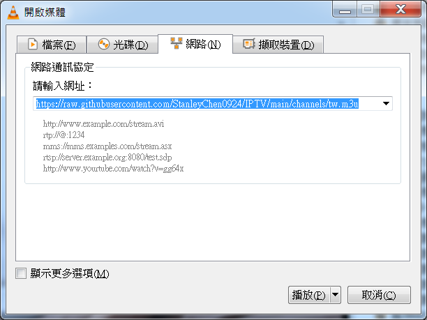

# IPTV

Collection of publicly available IPTV channels from all over the world.

Internet Protocol television (IPTV) is the delivery of television content over Internet Protocol (IP) networks.

## Usage

To watch IPTV you just need to paste this link `https://raw.githubusercontent.com/StanleyChen0924/IPTV/main/channels/tw.m3u` to any player which supports M3U-playlists.

